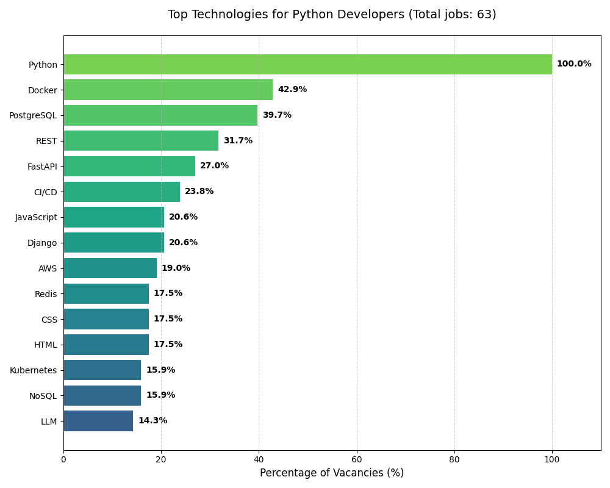
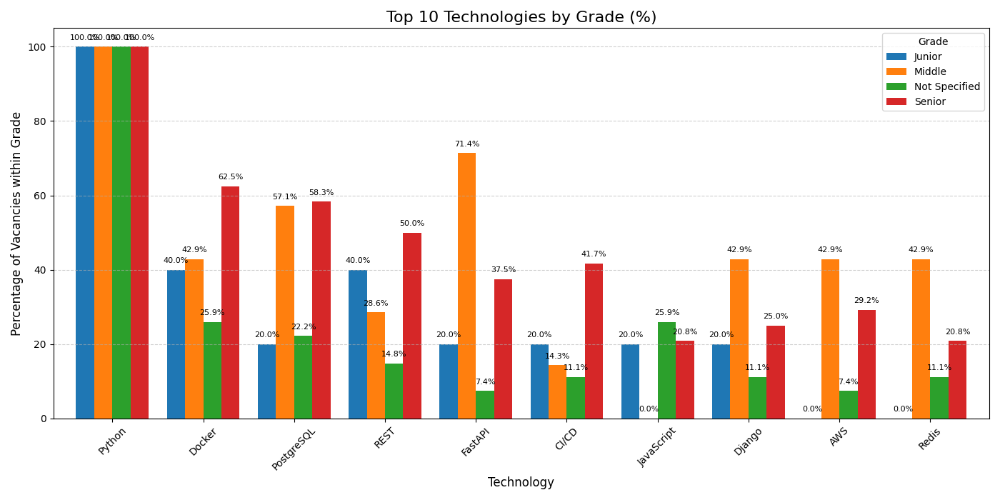

# Python Vacancies Analytics


## Overview

This project is a Python service for scraping and analyzing job vacancies. It collects vacancies, processes descriptions, extracts technologies and generates analytical charts to identify current market demands for Python developers and the most popular technologies mentioned in job descriptions.

---

## Features

- Scraping Python-related vacancies
- CSV data storage
- Experience level classification:
  - Junior
  - Middle
  - Senior
- Technology extraction from vacancy descriptions
- Technology demand analysis
- Charts generation

---

## Technologies Used

- Python
- Pandas
- Matplotlib
- Scrapy

---

## Configuration

Project configuration is stored inside `config.py`.

Example:

```python

DATA_DIR = BASE_DIR / "data" / "raw"

TECHNOLOGIES = [
    "Python", "Django", "Flask", "PostgreSQL"
]

START_URL = "https://www.work.ua/jobs-python/"
```

## Installation

Clone repository:

```bash
git clone <https://github.com/VPiliaiev/jobs-analysis.git>
```

Create virtual environment:

```bash
python -m venv venv
```

Activate virtual environment:

### Windows

```bash
venv\Scripts\activate
```

### Linux / macOS

```bash
source venv/bin/activate
```

Install dependencies:

```bash
pip install -r requirements.txt
```

---

## Run Project

### Run scraper

```bash
scrapy crawl jobs -O data/raw/jobs.csv
```

### Run analysis

Open Jupyter Notebook:

```bash
jupyter notebook
```

Then open the notebook from the `analysis/` directory and run all cells.

## Analytics Examples

### Top Technologies Distribution

Shows the most frequently mentioned technologies in job vacancies.



---

### Technologies by Experience Level

Shows which technologies are most commonly required for Junior, Middle, and Senior positions.

